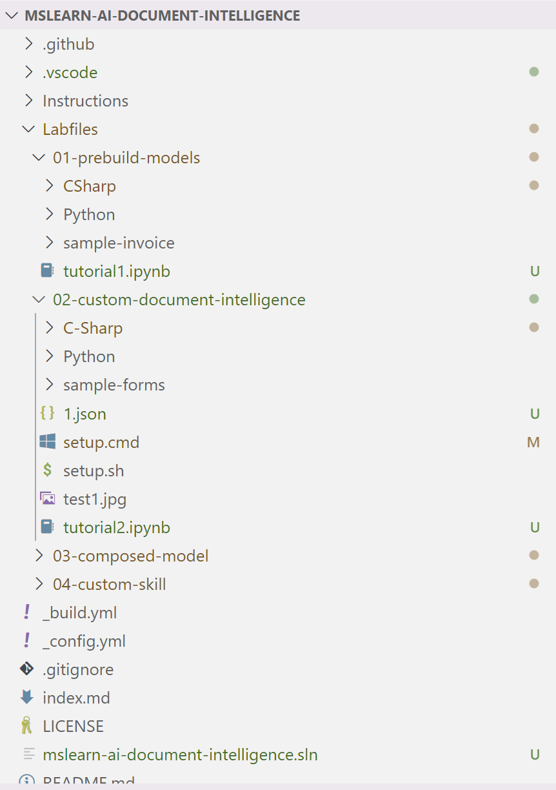

### Document Intelligence 실습에 오신 여러분 환영합니다!

실습을 하기 전,

꼭 Azure 포털에서 Azure 구독을 생성하고, 

  
Git을 사용할 수 있는 환경에서 실습 폴더를 사용할 위치로 이동한 후,

''' git clone https://github.com/MicrosoftLearning/mslearn-ai-document-intelligence''' 커맨드로,

로컬에 실습을 위한 폴더를 생성해주세요

이후,

tutorial1.ipynb , tutorial2.ipynb 파일을 다운 받고,

이 그림에서처럼 로컬로 만든 실습 폴더 안 01-prebuild-models, 02-customdocument-intelligence 폴더에 각각 넣어줍니다.

추가로, 실습 시 [실습1](./image/tutorial1_image.png) 파일이 사용될 예정입니다.

